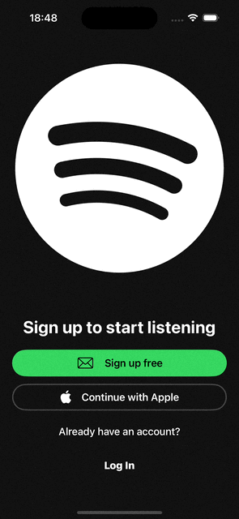
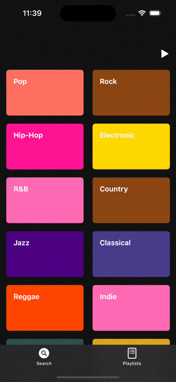
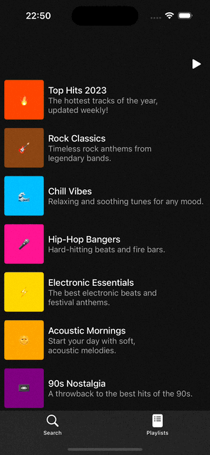
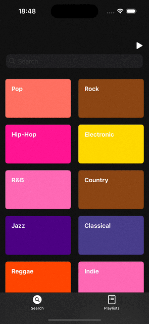

# spoticlone

A basic music app inspired on the Spotify app 

| SignIn | Login |
|--------|------|
|   |  |

| Sections | Player |
|--------|------|
|   |  |

## Concepts applied:
* Configure a project from `SceneDelegate`
* Storyboard and `XIB`'s to place UI elements
* Autolayout and `UIStackView` to resolve the position and size of UI elements
* App lifecycle as general information
* `UIViewController` lifecyle to know where configure UI elements
* Cocoa Model View Controller to define and architecture of our project
* `UINavigationController` and `UITabBarController` for navigation between controllers
* `UICollectionView` and `UITableView` to create grid collections and lists
* Diffable Data Source to handle the data in a list
* Delegate pattern to delegate behaivour to another classes
* `UISearchController` to filter data
* Extensions to add custom functionality to a type
* Human Interface Guidelines and SFSymbols to customize UI elements